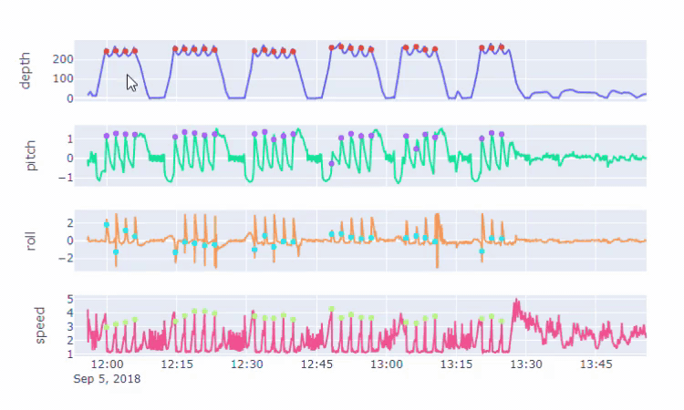
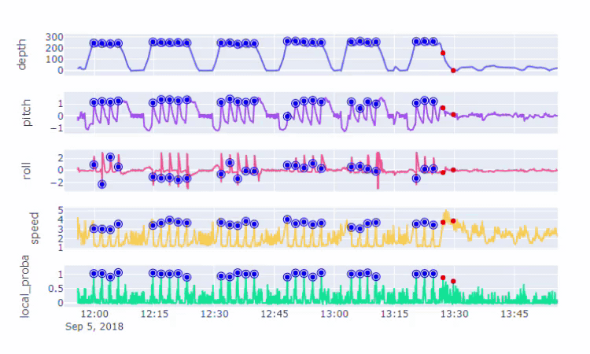

<!-- README.md is generated from README.Rmd. Please edit that file -->

```{r, include = FALSE}
knitr::opts_chunk$set(
  collapse = TRUE,
  comment = "#>",
  fig.path = "man/figures/README-",
  out.width = "100%"
)
```

# `rstickleback`

<!-- badges: start -->
[](https://codecov.io/gh/FlukeAndFeather/rstickleback?branch=main)
[](https://github.com/FlukeAndFeather/rstickleback/actions)
<!-- badges: end -->

> A machine learning pipeline for detecting fine-scale behavioral events in bio-logging data.

## Installation

You can install the development version of rstickleback from [GitHub](https://github.com/FlukeAndFeather/rstickleback) with:

```{r install, eval=FALSE}
# install.packages("devtools")
devtools::install_github("FlukeAndFeather/rstickleback")
```

## Key concepts

* Behavioral events are brief behaviors that can be represented as a point in time, e.g. feeding or social interactions.
* High-resolution bio-logging data (e.g. from accelerometers and magnetometers) are multi-variate time series. Traditional classifiers struggle with time series data.
* `stickleback` takes a time series classification approach to detect behavioral events in longitudinal bio-logging data.

## Quick start

### Load sample data

The included sensor data contains the depth, pitch, roll, and speed of six blue whales at 10 Hz, and the event data contains the times of lunge-feeding behaviors. 

```{r load_data}
library(rstickleback)
# `load_lunges()` returns a list of sensors and events, so we use the multiple
# assignment operator (%<-%) to destruct the list into separate `lunge_sensors`
# and `lunge_events` objects.
c(lunge_sensors, lunge_events) %<-% load_lunges()

# Again we use %<-%, to divide the sensors and events into test and train sets
test_deployids <- deployments(lunge_sensors)[1:3]
c(sensors_test, sensors_train) %<-% divide(lunge_sensors, test_deployids)
c(events_test, events_train) %<-% divide(lunge_events, test_deployids)
```

### Visualize sensor and event data

`sb_plot_data()` produces an interactive figure for exploring bio-logger data.

```{r view_data, eval=FALSE}
deployid <- deployments(lunge_sensors)[1]
sb_plot_data(deployid, lunge_sensors, lunge_events)
```



### Define model

Initialize a `Stickleback` model using Supervised Time Series Forests and a 5 s window.

```{r}
tsc <- compose_tsc(module = "interval_based", 
                   algorithm = "SupervisedTimeSeriesForest",
                   params = list(n_estimators = 2L, random_state = 4321L),
                   columns = columns(lunge_sensors))
sb <- Stickleback(tsc, 
                  win_size = 50, 
                  tol = 5, 
                  nth = 10, 
                  n_folds = 4, 
                  seed = 1234)
```

### Fit model

Fit the `Stickleback` object to the training data.

```{r}
sb_fit(sb, sensors_train, events_train)
```

### Generate predictions

Make predictions on the test data and assess prediction outcomes.

```{r}
predictions <- sb_predict(sb, sensors_test)
outcomes <- sb_assess(sb, predictions, events_test)
outcomes
```

### Visualize sensor and event data

`sb_plot_predictions()` produces an interactive figure for exploring model predictions.

```{r, eval=FALSE}
deployid <- deployments(sensors_test)[1]
sb_plot_predictions(deployid, sensors_test, predictions, outcomes)
```


